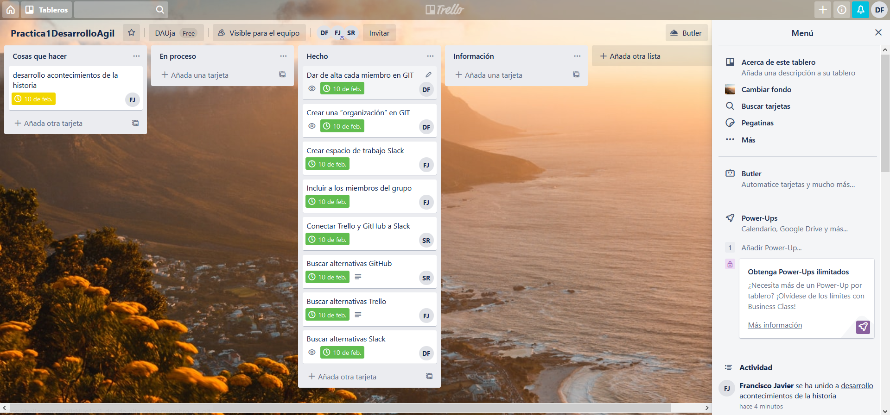
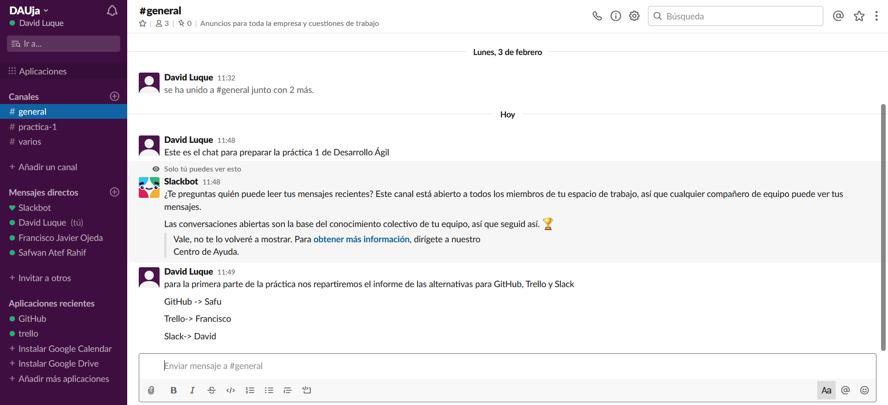

# Practica1

## Alternativa para GitHub: GitLab
Tanto **GitHub** como **GitLab** permiten mantener repositorios de código, tanto públicos como privados. La diferencia estriba en que, mientras que GitLab es siempre gratuito, GitHub solo te permite repositorios privados bajo suscripción.

## Alternativa a Trello: KanbanFlow
Tienes varias cosas que no se consiguen en **Trello**, como la posibilidad de añadir un **límite de tareas** a una columna para mantener algunos proyectos más enfocados y evitar abusar de la multitareas. Tienes **filtros** que te permiten mirar solo las tarjetas según un color, etiqueta, usuario o fecha de vencimiento. Tienes **tareas recurrentes** que se repiten automáticamente. Y, cuentas con integración con Dropbox, Box y Google Drive.

KanbanFlow es **gratuito** sin límite de tiempo ni de usuarios y además integra un reloj Pomodoro con estadísticas. También tienen un plan de pago que incluye reportes y analíticas mucho más extensas. Eso sí, no tienes aplicaciones nativas, pero puedes acceder a todo desde la web ya sea desde un ordenador o dispositivo móvil. 

## Alternativa a Slack: Spike
El punto fuerte de Spike es que **no requiere crear una cuenta**, sino que recurre a la cuenta de correo electrónico ya existente.

No obstante, el programa no se limita a la innovadora visualización de los correos en formato de chat. Como otras alternativas a Slack, Spike ofrece otros recursos para **facilitar la comunicación y la cooperación en los equipos**: los chats para grupos, el envío de archivos o la videotelefonía se cuentan entre ellos, así como también permite gestionar un calendario.
Para una mayor seguridad, Spike añade una función especial: el **cifrado de los mensajes**, tanto entre usuarios de la aplicación como en el envío de correos a otras personas.

*Ventajas*
1. Llamada de voz y vídeo
2. La versión gratis ya integra muchas funciones
3. Utiliza cuentas preexistentes de correo electrónico
4. Función de búsqueda muy extensa
5. Diseño claro

*Inconvenientes*
1. No permite integrar otras aplicaciones

### Capturas de Slack y Trello

 

 

